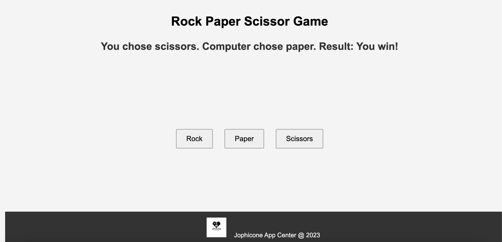

# Rock-Paper-Scissor-Game
Welcome to the classic game of Rock, Paper, Scissors! Test your luck and strategy in this timeless battle of choices. Whether you choose the strength of Rock, the versatility of Paper, or the precision of Scissors, the computer awaits your challenge.

## Overview
Welcome to the Rock, Paper, Scissors Game! This classic and timeless game is now available for you to enjoy on the Jophicone Game App Center. Test your luck and strategic thinking in this digital rendition of the well-loved Rock, Paper, Scissors.

## How to Play
Click on the "Rock," "Paper," or "Scissors" buttons to make your move.
The computer will randomly select its move.
The game will determine the winner based on the classic rules:
Rock crushes Scissors
Scissors cuts Paper
Paper covers Rock
## Features
Simple and intuitive gameplay.
Randomized computer moves for added challenge.
Instant results displayed on the screen after each round.
Enjoyable for players of all ages.
## Installation
No installation is required! Simply access the game through the Jophicone Game App Center and start playing.

## Contributing
If you have suggestions for improvements or new features, feel free to fork the repository and submit a pull request. Your contributions are welcome!
## Screenshots

## License
This project is licensed under the [License Name] - see the [LICENSE.md](./LICENSE) file for details.

## Acknowledgments
Developed by Jofiel Nguyen
Built with HTML, CSS, and JavaScript.
## Contact
For any inquiries or issues, please contact Jofiel Nguyen .
Please refrain from re-uploading the code; enjoy the game here!

Enjoy the game!